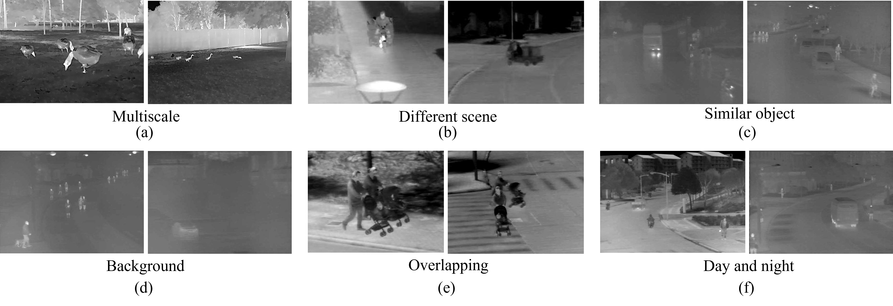

#  IFSOD: Infrared Few-Shot Object Detection Benchmark

[](https://ieeexplore.ieee.org/document/10879460)
[](https://doi.org/10.1109/TGRS.2025.3540945)
[](https://doi.org/10.1109/TGRS.2025.3540945)

<div align="center">

<p><em>Fig. 1 - Multi-scenario infrared target samples (Armored Vehicles/Pedestrians/Bicycles etc.)</em></p>
</div>

##  Key Features
| | |
|--|--|
|  **Multi-Scenario** | 12 complex scenarios (Urban/Rural/Night etc.) |
|  **Rich Taxonomy** | 18 coarse-grained categories (Military/Civilian) |
|  **Few-Shot Ready** | 3 predefined splits (Balanced Base/Novel classes) |
|  **High Resolution** | Average 662×489 pixels |

---

##  Dataset Structure
```bash
IFSOD-dataset/
├── annotations/ # PASCAL VOC format XMLs
├── images/ # 8-bit grayscale JPGs
├── splits/ # Partition schemes
│ ├── split1/ # Partition I
│ ├── split2/ # Partition II
│ └── split3/ # Partition III
└── README.md # Documentation
```

---

##  Data Partitions (Base/Novel Classes)
<table>
<tr>
<th>Partition I</th>
<th>Partition II</th>
<th>Partition III</th>
</tr>
<tr>
<td>

| **Base Classes** | Instances |
|------------------|-----------|
| Armored Car | 217 |
| Car | 4,167 |
| People | 14,860 |

| **Novel Classes** | Shots |
|-------------------|-------|
| Duck | 10 |
| Ebike | 10 |
| Bus | 10 |

</td>
<td>

| **Base Classes** | Instances |
|------------------|-----------|
| Kettle | 122 |
| Stroller | 196 |
| Goose | 193 |

| **Novel Classes** | Shots |
|-------------------|-------|
| Armored Car | 10 |
| Truck | 10 |

</td>
<td>

| **Base Classes** | Instances |
|------------------|-----------|
| People | 14,860 |
| Umbrella | 217 |
| Luggage | 614 |

| **Novel Classes** | Shots |
|-------------------|-------|
| Bus | 10 |
| Dog | 10 |

</td>
</tr>
</table>

---

##  Benchmark Comparison
<div align="center">

| Dataset |  Images |  Instances |  Classes |
|---------------|:-------:|:---------:|:-------:|
| RGB-T234 | 233,928 | 116,660 | 145 |
| M3FD | 9,200 | 34,408 | 6 |
| **IFSOD** | <div class="highlight">4,815</div> | <div class="highlight">23,333</div> | <div class="highlight">18</div> |

<sub>*Highlighted metrics show key advantages of our dataset</sub>
</div>

---

##  Download
```diff
! Access Options:
+ Baidu Cloud: [Link](https://pan.baidu.com/...)
```

---


##  Citation
<div align="center">

**Please cite our TGRS paper:**
```bibtex
@article{zhang2025benchmark,
title = {A Benchmark and Frequency Compression Method for Infrared Few-Shot Object Detection},
author = {Zhang, Ruiheng and Yang, Biwen and Xu, Lixin and Huang, Yan and Xu, Xiaofeng and Zhang, Qi and Jiang, Zhizhuo and Liu, Yu},
journal = {IEEE Transactions on Geoscience and Remote Sensing},
year = {2025},
volume = {63},
pages = {1--11},
doi = {10.1109/TGRS.2025.3540945}
}
```
[](https://doi.org/10.1109/TGRS.2025.3540945)
</div>
``
